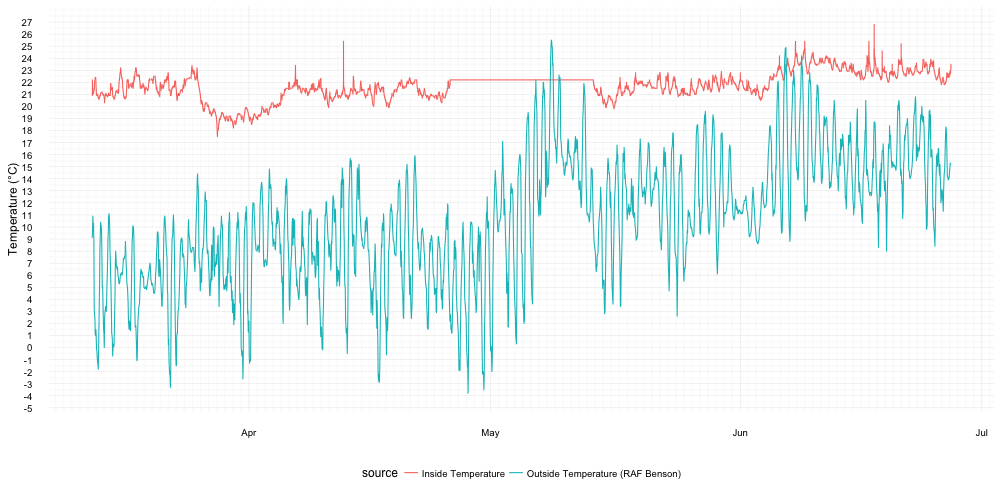
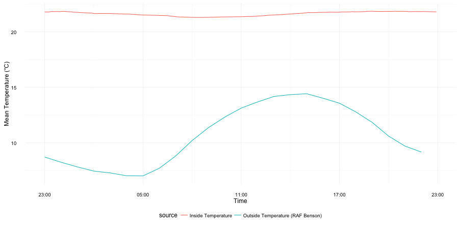
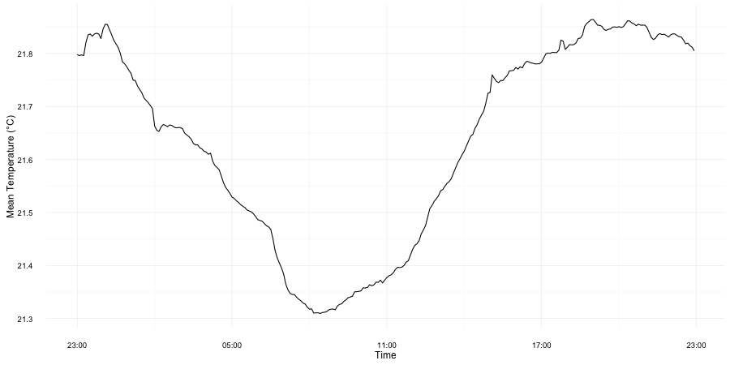

# temperature-tracker
Tracking my room temperature with a data logger.

# Hardware
[Elitech URC5](http://www.elitech.uk.com/temperature_logger/Elitech_USB_Temperature_Data_logger_RC_5_147.html) avaliable from [Amazon.co.uk](https://www.amazon.co.uk/dp/B00MQSCZF2/) for ~ £14 inc p&p.

# Software
In order to read data from the USB stick on to a mac osx computer drivers are required: both RC-5 and RC4&RC4H from [Elitech.co.uk](http://www.elitech.uk.com/software.html).
I set the logger to record the temperature every 2 minutes so it takes 44 days to fill up the recorder storage. The data is downloaded and converted to (a badly formatted) tab seperated variable file by the "Rc logger" software (in the tar with the drivers). I name the files as "temperature1.tsv", "temperature2.tsv" etc.

# External Data
To compare the recorded temperature inside my room to the outside temperature I used temperature from the nearest weather station with avaliable open data (RAF Benson). The data is hosted on the [Microsoft Azure Marketplace](https://datamarket.azure.com/dataset/datagovuk/metofficeweatheropendata) - registration is required but it is free and unlimited. The primary account key is kept in a file named 'config.R' in the same directory (censored by .gitignore here) with the following format:

```R
api.key <- "ExampleApiKey0908338"
```

# Results



You can see when I went away towards the end of March and turned down my radiator. Unfortunately towards the end of April the storage ran out and I forgot to empty it.

We can also plot temperature in a calendar fashion which helps in identifying weekly patterns:


Calculating an average temperature over a day we can see again that the fluctuation in the outisde temperature is much greater than in my room.


Zooming in to just the internal temperature you can see that it does fluctuate. I'm tempted to suggest that the small peak after midnight is due to the use of a hairdryer after using the shower.

