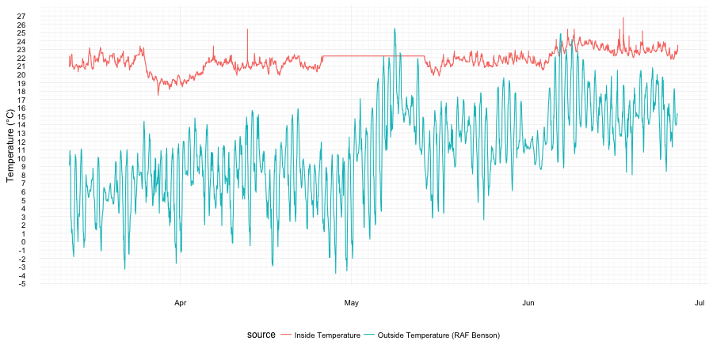

# temperature-tracker
Tracking my room temperature with a data logger.

# Hardware
[Elitech URC5](http://www.elitech.uk.com/temperature_logger/Elitech_USB_Temperature_Data_logger_RC_5_147.html) avaliable from [Amazon.co.uk](https://www.amazon.co.uk/dp/B00MQSCZF2/) for ~ £14 inc p&p.

## Software
In order to read data from the USB stick on to a mac osx computer drivers are required: both RC-5 and RC4&RC4H from [Elitech.co.uk](http://www.elitech.uk.com/software.html).
I set the logger to record the temperature every 2 minutes so it takes 44 days to fill up the recorder storage. The data is downloaded and converted to (a badly formatted) tab seperated variable file by the "Rc logger" software (in the tar with the drivers). I name the files as "temperature1.tsv", "temperature2.tsv" etc.

# External Data
To compare the recorded temperature inside my room to the outside temperature I used temperature from the nearest weather station with avaliable open data (RAF Benson). The data is hosted on the [Microsoft Azure Marketplace](https://datamarket.azure.com/dataset/datagovuk/metofficeweatheropendata) - registration is required but it is free and unlimited. The primary account key is kept in a file named 'config.R' in the same directory with the following format:

```R
api.key <- "ExampleApiKey0908338"
```

# Results

