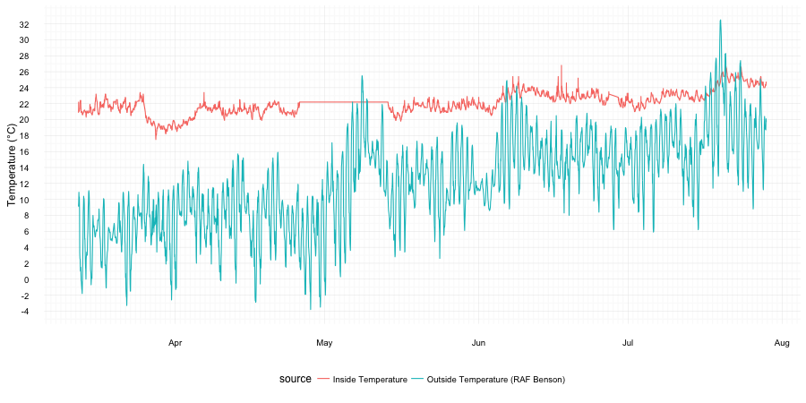

# temperature-tracker
Tracking my room temperature with a data logger, inspired by [this reddit post](https://www.reddit.com/r/dataisbeautiful/comments/47xgos/how_cold_is_my_nyc_apartment_oc/).

# Hardware
[Elitech URC5](http://www.elitech.uk.com/temperature_logger/Elitech_USB_Temperature_Data_logger_RC_5_147.html) avaliable from [Amazon.co.uk](https://www.amazon.co.uk/dp/B00MQSCZF2/) for ~ £14 inc p&p.

# Software
In order to read data from the USB stick on to a mac osx computer drivers are required: both RC-5 and RC4&RC4H from [Elitech.co.uk](http://www.elitech.uk.com/software.html).
I set the logger to record the temperature every 2 minutes so it takes 44 days to fill up the recorder storage. The data is downloaded and converted to (a badly formatted) tab seperated variable file by the "Rc logger" software (in the tar with the drivers). I name the files as "temperature1.tsv", "temperature2.tsv" etc.

Plots were created in R with the packages data.table, lubridate, ggplot2, ggTimeSeries, and RColorBrewer.
```bash
Rscript plot_temperature.R
```

# External Data
To compare the recorded temperature inside my room to the outside temperature I used temperature from the nearest weather station with avaliable open data (UK Met Office Weather Open Data - RAF Benson). The data is hosted on the [Microsoft Azure Marketplace](https://datamarket.azure.com/dataset/datagovuk/metofficeweatheropendata) - registration is required but it is free and unlimited. The primary account key is kept in a file named 'config.R' in the same directory (censored by .gitignore here) with the following format:

```R
api.key <- "ExampleApiKey0908338"
```

# Results



You can see when I went away towards the end of March and turned down my radiator. Unfortunately towards the end of April the storage ran out and I forgot to empty it.

We can also plot temperature in a calendar fashion which helps in identifying weekly patterns. In this form the decrease in temperature whilst I was away and the missing data is more obvious.


Calculating an average temperature over a day we can see again that the fluctuation in the outisde temperature is much greater than in my room.


Zooming in by mean-centering and scaling each data set to equal variance you can see that the inside temperature does fluctuate in a similar pattern to the outside temperature but with a time lag. I'm tempted to suggest that the small peak at about midnight is due to the use of the hairdryer after showering.
